<div align="center">


<a href="https://www.linkedin.com/in/ayush-isamaliya-686533312/"></a>
<a href="mailto:aisamaliya@gmail.com"></a>
<a href="https://github.com/isamaliya16"></a>
</div>

<br/>

## 📌 Overview

<table>
<tr>
<td width="60%" valign="top">

**👋 Hi, I'm Ayush — a Data Science learner turning raw data into decisions.**

I specialize in building the full data pipeline: cleaning messy datasets, engineering meaningful features, running rigorous statistical analysis, and training supervised learning models that solve real business problems — fraud detection, delivery/ride analytics, and BI reporting.

I approach every project the same way a data scientist in production would: define the question → explore the data → engineer features → model → validate → communicate. Every repo in my portfolio follows that lifecycle.

</td>
<td width="40%" valign="top">

```yaml
role:          Data Science Learner
location:      Gujarat, India
focus_areas:
  - Statistics & Probability
  - Feature Engineering
  - Supervised Learning
  - BI Dashboarding
currently:     Supervised Learning
next:          Deep Learning → RL
availability:  Open to opportunities 🟢
```

</td>
</tr>
</table>

---

## 🧬 About Me

<table>
<tr>
<td width="25%" align="center">🎯<br/><b>Specialization</b><br/>Data Science, ML & Analytics</td>
<td width="25%" align="center">🧠<br/><b>Approach</b><br/>Statistically-grounded, end-to-end pipelines</td>
<td width="25%" align="center">📊<br/><b>Deliverables</b><br/>Models, dashboards, insight reports</td>
<td width="25%" align="center">🤝<br/><b>Open to</b><br/>Internships, entry-level roles, collabs</td>
</tr>
</table>

- 🔭 **Currently building:** end-to-end ML pipelines — from raw CSVs to deployment-ready, evaluated models
- 🧮 **Deep focus on:** inferential statistics, hypothesis testing, and probability-driven decision-making
- 📈 **Also do:** Power BI / Excel dashboards for stakeholder-facing reporting
- 🌱 **Leveling up toward:** Deep Learning (CNNs) and Reinforcement Learning
- 💬 **Ask me about:** EDA, feature engineering, imbalanced classification (SMOTE), regression diagnostics, ensemble methods
- 💼 **Recently completed:** a 6-month AI/ML, Data Science & QA internship at Red & White Multimedia Education

---

## 🛠️ Tech Stack & Expertise

### Programming & Core Tools
<div>

</div>

### Data Science & Machine Learning
| Category | Tools |
|---|---|
| **Data Handling** |   |
| **Modeling** |    |
| **Deep Learning & GenAI** |   |
| **Imbalanced Data** |  SMOTE · Class Weighting |
| **Statistics** | Hypothesis Testing · Regression Diagnostics · Probability Distributions |
| **Visualization** |    |
| **BI & Reporting** |   DAX |
| **Web & APIs** |    |
| **Environments** |    |

### Proficiency Snapshot
```text
Python              ████████████████████░░░░  80%
SQL                  ███████████████████████░  90%   (Advanced — HackerRank certified)
Statistics & Prob.   ██████████████████████░░  85%
Feature Engineering  ███████████████████████░  90%
Supervised Learning  ██████████████████░░░░░░  70%
Power BI / Excel     █████████████████░░░░░░░  65%
Deep Learning        ████░░░░░░░░░░░░░░░░░░░░  15%  (in progress)
```

---

## 📊 GitHub Analytics

<div align="center">


</div>

---

## 🚀 Featured Projects

<table>
<tr>
<th align="left">Project</th>
<th align="left">Problem Solved</th>
<th align="left">Techniques</th>
<th align="left">Stack</th>
</tr>
<tr>
<td>📈 <a href="https://github.com/isamaliya16/Power_BI_Dashboard_Sales_Customer_Intelligence"><b>Sales & Customer Intelligence Dashboard</b></a></td>
<td>Executive-facing sales performance & customer segmentation view</td>
<td>Star schema, advanced DAX, RLS, drill-through</td>
<td><code>Power BI</code> <code>DAX</code></td>
</tr>
<tr>
<td>📦 <a href="https://github.com/isamaliya16/Amazon-delivery-analytics-preprocessing"><b>Amazon Delivery Analytics</b></a></td>
<td>Cleans & engineers features for 50,000+ delivery records</td>
<td>KNN imputation, outlier handling, ColumnTransformer</td>
<td><code>Python</code> <code>Pandas</code> <code>Scikit-learn</code></td>
</tr>
<tr>
<td>🚕 <a href="https://github.com/isamaliya16/Ola-ride-preprocessing-pipeline"><b>Ola Ride Preprocessing Pipeline</b></a></td>
<td>Production-style preprocessing for ETA/surge-pricing models</td>
<td>ColumnTransformer, Pipeline, custom transformers</td>
<td><code>Python</code> <code>Pandas</code></td>
</tr>
<tr>
<td>🔍 <a href="https://github.com/isamaliya16/credit-fraud-detection-supervised-learning"><b>Credit Fraud Detection</b></a></td>
<td>Flags fraudulent transactions in highly imbalanced data</td>
<td>Logistic Regression, Random Forest, XGBoost, SMOTE, PR-AUC</td>
<td><code>Python</code> <code>scikit-learn</code> <code>XGBoost</code></td>
</tr>
<tr>
<td>🏦 <a href="https://github.com/isamaliya16/Robust-Regression-Engine-SL"><b>Robust Regression Engine</b></a></td>
<td>House price prediction with outlier-robust regressors</td>
<td>Ridge, Lasso, Decision Tree, RF, SVR, cross-validation</td>
<td><code>Python</code> <code>scikit-learn</code></td>
</tr>
<tr>
<td>🎯 <a href="https://github.com/isamaliya16/Smart-Outcome-Predictor-using-Ensemble-Learning"><b>Smart Outcome Predictor</b></a></td>
<td>Predicts student outcomes from academic + behavioral data</td>
<td>Bagging, Boosting, Voting, Stacking</td>
<td><code>Python</code> <code>scikit-learn</code></td>
</tr>
</table>

<div align="center">

*↳ Browse the complete portfolio: [all repositories →](https://github.com/isamaliya16?tab=repositories)*

</div>

---

## 🎓 Certifications

<div align="center">

-HackerRank-2EC866?style=for-the-badge&logo=hackerrank&logoColor=white)


</div>

---

## 🏆 Achievements

- 🥇 **1st Place — Python Analyzers**, TECHWAR 2026, Red & White Skill Education *(Jan 2026)*
- 🤖 **Participant — Robotics**, VAIVIDHYA 2k26 State-Level TechFest, SSASIT Surat *(Feb 2026)*

---

## 🗺️ Learning Roadmap

```mermaid
graph LR
    A[✅ Python & SQL] --> B[✅ Statistics & Probability]
    B --> C[✅ Feature Engineering]
    C --> D[🔄 Supervised Learning]
    D --> E[⏳ Unsupervised Learning]
    E --> F[⏳ Deep Learning]
    F --> G[⏳ Reinforcement Learning]
    G --> H[🎯 ML Engineer / Data Scientist]

    style A fill:#4c72b0,color:#fff
    style B fill:#4c72b0,color:#fff
    style C fill:#4c72b0,color:#fff
    style D fill:#f2c811,color:#000
    style E fill:#2b2b2b,color:#fff
    style F fill:#2b2b2b,color:#fff
    style G fill:#2b2b2b,color:#fff
    style H fill:#6c63ff,color:#fff
```



---

## 📈 Impact Snapshot

<div align="center">

| 53+ | 6 | 5 | 1 |
|:---:|:---:|:---:|:---:|
| **Public Repos** | **Flagship Projects** | **Certifications** | **Competition Win 🥇** |

</div>

---

## 🌐 Let's Connect

<div align="center">

<a href="https://www.linkedin.com/in/ayush-isamaliya-686533312/"></a>
<a href="mailto:aisamaliya8@gmail.com"></a>
<a href="https://github.com/isamaliya16"></a>

</div>

<div align="center">


**⭐ Thanks for visiting — explore the repos, star what's useful, and let's connect!**

</div>
